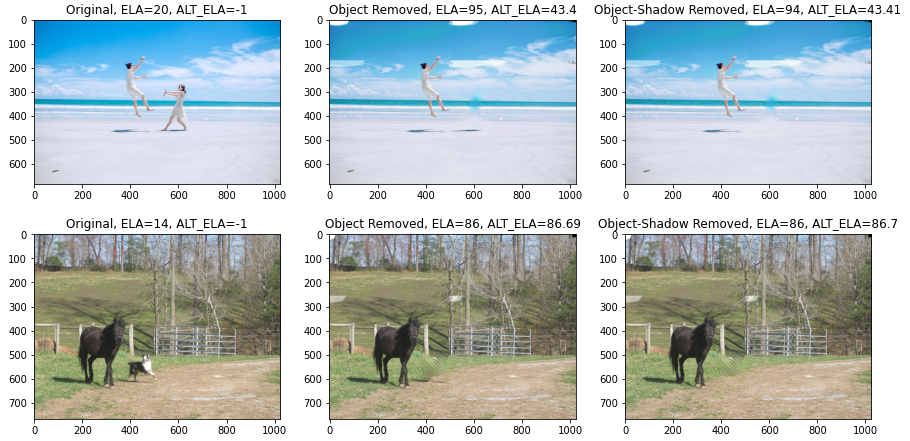

# Instance Shadow Segmentation for Image Object Removal



Our work is fundametally built on top of:
* [Instance Shadow Segmentation](https://github.com/stevewongv/InstanceShadowDetection)
* [Partial Convolutions for Image Inpainting using Keras](https://github.com/MathiasGruber/PConv-Keras)

By using a model which detects objects together with their respective shadows (LISA), we can improve on the object removal from images by removing the shadow associated with the object as well. For object removal, we employ a model which uses partial convolution to do image inpainting.

# Environment
The notebooks should handle their own enviroment setup for their respective tasks. Access to a GPU is assumed in both cases. The demo notebook is built and tested on Google Colab so all the library installations are done accordingly. The training notebook is built  Please refer to the two linked repos for more detailed explanations on the dependencies of each model.

* Files need to run the demo and the dataset for training can be found here: [comvis project](https://drive.google.com/drive/folders/11pal1EmQLp_1FND37bCpP3qUTIh_3jEr?usp=sharing)

# Datasets & Training
The LISA model is trained with the [SOBA](https://drive.google.com/drive/folders/1MKxyq3R6AUeyLai9i9XWzG2C_n5f0ppP) dataset. While the GMCNN Model is trained with pictures of places. This model has three different variations, but the `Places2` and `paris_streetview` are more appropriate for our use case (refer to the GM-CNN repo for more detail). 

We use pictures from the SOBA dataset to display our results, since they consist of objects with their images, which is convenient to display our project's capabilities.

The repos we linked go in greater detail on the procedures required to train the models. For the sake of convenience, our code uses the pretrained weights for both models in order to make predictions.

* [LISA Weights](https://drive.google.com/drive/folders/1MKxyq3R6AUeyLai9i9XWzG2C_n5f0ppP)
* GM-CNN Weights: [Places2](https://drive.google.com/file/d/1wgesxSUfKGyPwGQMw6IXZ9GLeZ7YNQxu/view?usp=sharing), [paris_streetview](https://drive.google.com/file/d/1aakVS0CPML_Qg-PuXGE1Xaql96hNEKOU/view?usp=sharing)

# Running Experiments
All our tests can be run through the `Clean ComVis Project.ipynb`. Sequentially run the cells following any instruction in the form of comments or text cells. We performed our tests on Google Colab. 

**Note:** Make sure to have the rest of the files of the repo in the same directory as your notebook. When working with Google Colab, upload these files in the local path (`./`) of the session. 

# Group Members
* Gledis Zeneli 
* Balaj Saleem

# Citations
```
@InProceedings{Wang_2020_CVPR,
author = {Wang, Tianyu and Hu, Xiaowei and Wang, Qiong and Heng, Pheng-Ann and Fu, Chi-Wing},
title = {Instance Shadow Detection},
booktitle = {IEEE/CVF Conference on Computer Vision and Pattern Recognition (CVPR)},
month = {June},
year = {2020}
}

@inproceedings{liu2018partialpadding,
author = {Guilin Liu and Kevin J. Shih and Ting-Chun Wang and Fitsum A. Reda and Karan Sapra and Zhiding Yu and Andrew Tao and Bryan Catanzaro},
title = {Partial Convolution based Padding},
booktitle = {arXiv preprint arXiv:1811.11718},   
year = {2018},
}

@inproceedings{liu2018partialinpainting,
author = {Guilin Liu and Fitsum A. Reda and Kevin J. Shih and Ting-Chun Wang and Andrew Tao and Bryan Catanzaro},
title = {Image Inpainting for Irregular Holes Using Partial Convolutions},
booktitle = {The European Conference on Computer Vision (ECCV)},   
year = {2018},
}
```